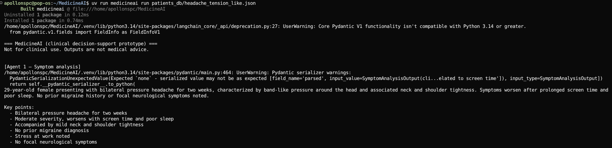
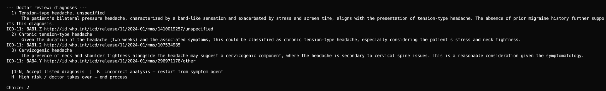
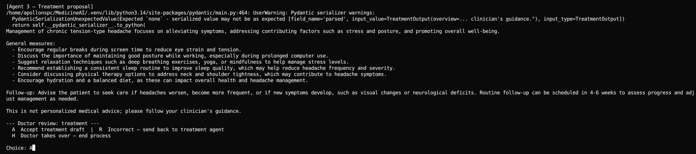
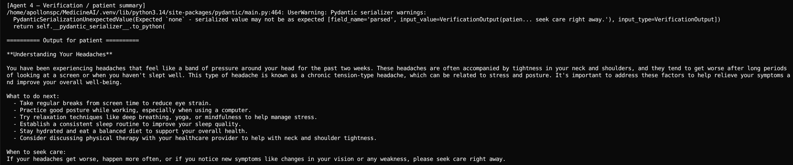
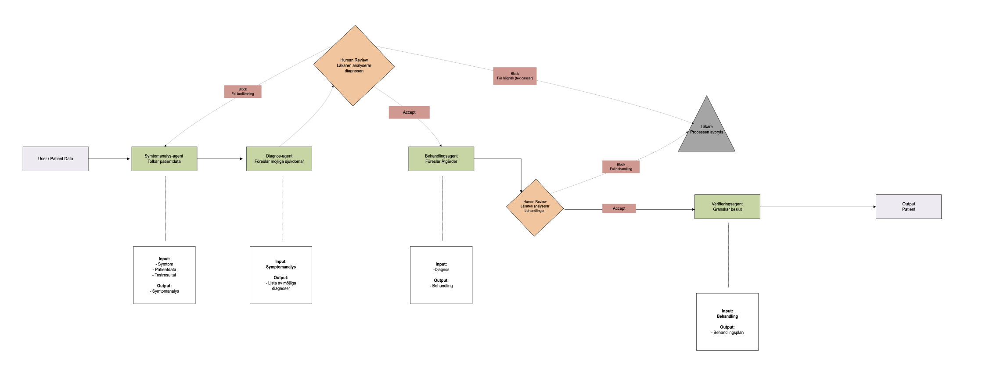

# MedicineAI

Multi-agent clinical decision-support prototype: symptom analysis → diagnosis suggestions → doctor review → treatment proposal → doctor review → patient-facing summary.

## Demo (workflow screenshots)

### 1) Symptom agent



### 2) Diagnosis + first doctor review



### 3) Treatment + second doctor review



### 4) Verification / patient output



## Architecture



## Run

```bash
uv sync
cp .env.example .env   # set OPENAI_API_KEY (+ optional ICD_* credentials)

uv run medicineai validate patients_db/example_case.json
uv run medicineai run patients_db/example_case.json --log session.json
```

The `--log session.json` file contains the full audit trail for that run (agent outputs + doctor decisions).

## ICD-11 API (optional)

Set `ICD_CLIENT_ID` and `ICD_CLIENT_SECRET` in `.env`.
If credentials are missing, the app still runs; the diagnosis agent uses only the LLM (with a note in the ICD context section).

If ICD search returns no results or fails, adjust `ICD_RELEASE_ID` (MMS release id) in `.env` according to the WHO ICD-11 API documentation.

## Patient cases

Put JSON inputs in `patients_db/` (validated against `schemas.PatientCase`).
