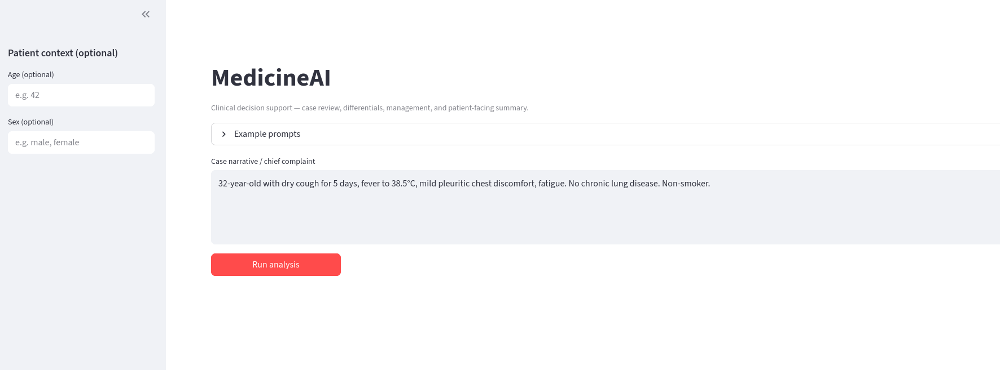
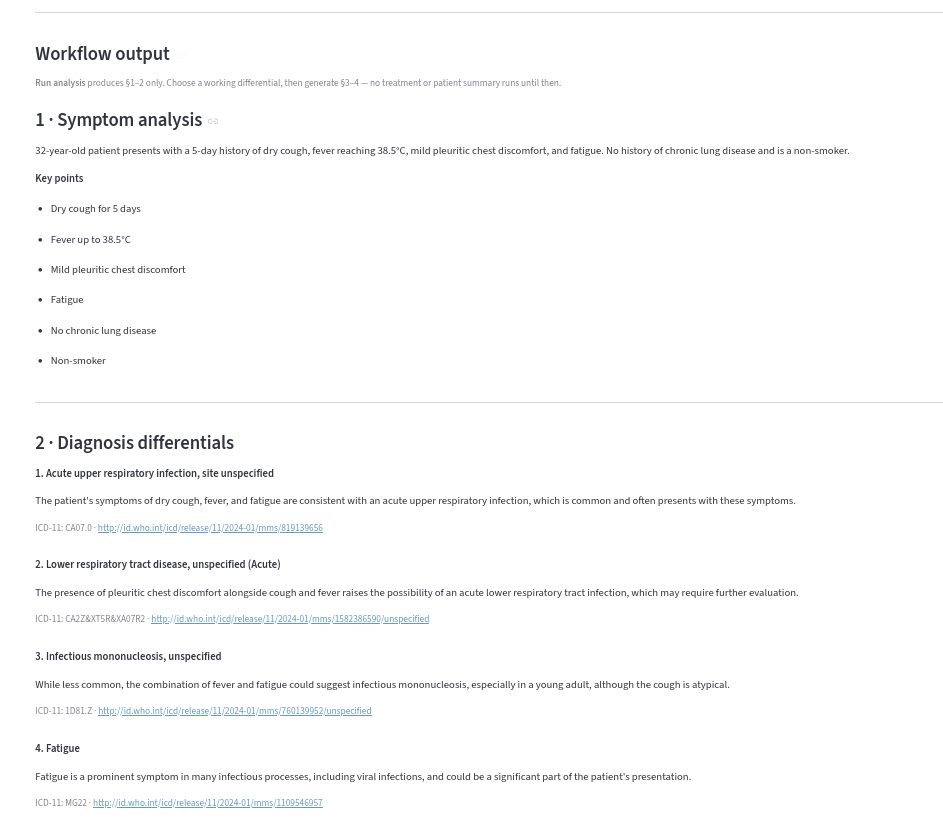
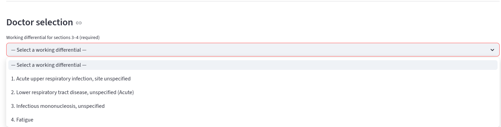
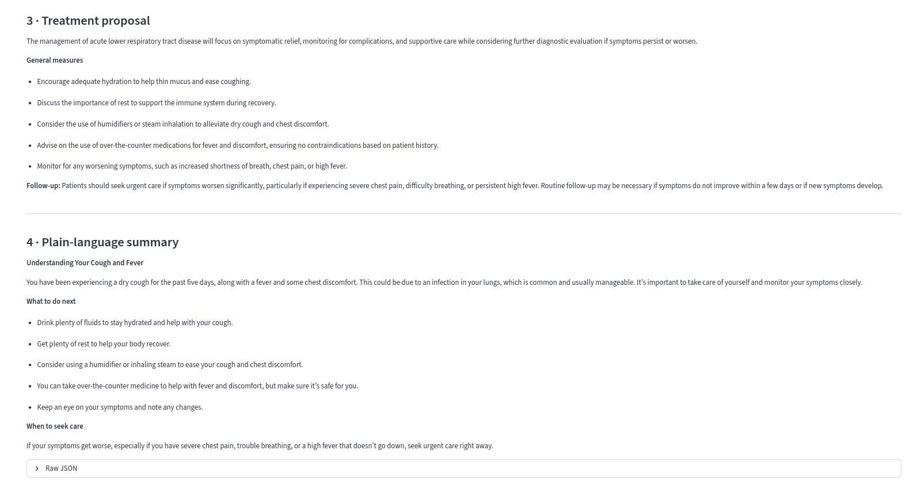

# MedicineAI

Multi-agent clinical workflow: symptom analysis → ranked differentials → doctor selection → treatment → patient-facing summary.

**CLI** (interactive, JSON cases) · **HTTP API** (`/v1/analyze` → `/v1/continue`, optional `/v1/ask`) · **Streamlit** (web UI).

```bash
uv sync && cp .env.example .env   # OPENAI_API_KEY; optional ICD_* for ICD-11 MMS
```

---

## CLI

Full pipeline with **terminal prompts** (not the HTTP split flow):

```bash
uv run medicineai validate patients_db/example_case.json
uv run medicineai run patients_db/example_case.json --log session.json
```

Patient JSON lives under **`patients_db/`** (`schemas.PatientCase`).

---

## API + Streamlit (local)

```bash
# shell 1
uv run uvicorn medicineai.api.main:app --host 127.0.0.1 --port 8000

# shell 2 — API_URL optional; defaults work for localhost
API_URL=http://127.0.0.1:8000 uv run streamlit run src/frontend/app.py
```

- Docs / try-it: [http://localhost:8000/docs](http://localhost:8000/docs)
- **`POST /v1/analyze`** — symptom + diagnosis (+ ICD context); no §3–4 yet  
- **`POST /v1/continue`** — treatment + verification for a chosen `diagnosis_index`  
- **`POST /v1/ask`** — full non-interactive run in one shot (optional)

---

## Docker

`dockerfiles/Dockerfile.backend` + `Dockerfile.frontend`. UI needs **`API_URL=http://api:8000`** in Compose.

```bash
docker compose up --build
```

API · UI → ports **8000** / **8501**.

---

## Azure (two Web Apps)

Use your backend **HTTPS** URL (not `http://api:8000`). Set **`WEBSITES_PORT`** `8000` / `8501`, **`API_URL`**=`https://<backend>.azurewebsites.net` on the frontend, model keys on the backend. Restart after changes.

---

## Screenshots

<details>
<summary><strong>CLI (terminal)</strong></summary>


</details>

<details>
<summary><strong>Streamlit</strong></summary>






</details>

## Architecture


---

## ICD-11 (optional)

**ICD-11** is WHO’s *International Classification of Diseases*, 11th revision — a standard vocabulary for labeling diagnoses. With API credentials, MedicineAI can fetch short ICD-11 MMS snippets as extra context for the diagnosis step; without them, that step still runs using the LLM only.

Set **`ICD_CLIENT_ID`** / **`ICD_CLIENT_SECRET`** in `.env`; adjust **`ICD_RELEASE_ID`** if needed ([WHO ICD API](https://icd.who.int/icdapi)).
